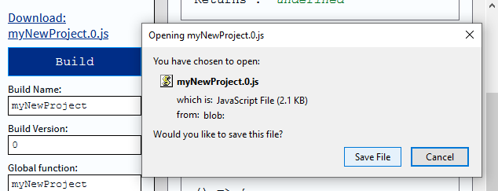

# LimnJS Beta
An in-browser, live, type-enforced, code-explorer and auto-documenter for JavaScript with no performance penalty.

# What?
Develop a site, webapp or JavaScript library with LimnJS.  

During development, your source code runs in the browser, live, with type-enforcement in the console and auto-documentation in a code explorer.  
When you deploy, you remove LimnJS: No overhead or performance penalty.  

It's the best of all worlds: 

**preview / debug source + type enforcement + performance**

# Index
1. [In Three Steps](#in-three-steps)
1. [Beta](#beta)
    1. [Can I Use it?](#can-i-use-it)
    2. [How Long is Beta?](#how-long-is-beta)
2. [Get Up and Running](#get-up-and-running)
3. [Basics](#basics)
    1. [An Imaginary App Using LimnJS](#an-imaginary-app-using-limnjs)
4. [Examples](#examples)
    1. [boxes](#boxes)
    2. [platformer](#platformer)
5. [Building with LimnJS](#building-with-limnjs)
    1. [Modules](#modules)
        1. [imports](#imports)
        2. [parameters](#parameters)
        3. [returns](#returns)
        4. [emits](#emits)
        5. [factory](#factory)
    2. [Outlines](#outlines)
        1. [Why Use Outlines (Types)?](#why-use-outlines-types)
        2. [Outlines Are Not Exactly Types](#outlines-are-not-exactly-types)
        3. [Using Outlines](#using-outlines)
        4. [Outline Primitives](#outline-primitives)
        5. [Creating Outlines](#creating-outlines)
        10. [Object Template Outlines](#object-template-outlines)
        11. [Documented Function Outlines](#documented-function-outlines)
        12. [Array Outlines](#array-outlines)
        13. [Array Template Outlines](#array-template-outlines)
    3. [Listeners](#listeners)
6. [Video Tutorial (Not Available!)](#video-tutorial-not-available)
7. [Background and Trivia](#background-and-trivia)
    1. [What is "Limn"?](#what-is-"limn")
    2. [LimnJS's Outline System](#limnjss-outline-system)
    3. [Why Make LimnJS](#why-make-limnjs)
8. [Licensing?](#licensing)
9. [License](#license)

# In Three Steps

1. **Develop and debug with types in the browser console.**  
    

2. **Deep-dive into your codebase's interactions with a live code-explorer launched from the browser's console.**  
   ```javascript
   MyAppName.Explore(); //launches a pop-up window containing the explorer
   //or:
   MyAppName.Explore( someHTMLNode ); //inserts the explorer into someHTMLNode
   ```
   The explorer is screenshotted below.
   It doubles as beautiful documentation.  
   Because it pulls from source, your documentation always stays up-to-date.
   Please see the examples for click / hover interactivity not visible in the screenshot.  
   (This screenshot is from the platformer example included. See "examples/platformer/platformer.dev.html")
    

3. **After developing, you don't deploy LimnJS**, just your code plus 3kb linking your modules.

    (From the platformer example):  

    27 Source files at 16.2kb:  
      

    1 built file at 18.8kb:  
      

    It's like having an IDE explorer, auto-documenter, and compiler built into your webapp while you run it in the browser.

# Beta

LimnJS is in beta. 
- Its interface might change
- It might not behave exactly like the documentation claims

## Can I Use It?

Originally, I wrote "No." here. 

However, for some reason, LimnJS is working perfectly.  
It's stable, fast, and conforming to the documentation.  
So, if you want to use it, I guess... go ahead?

Don't use it at work. (At least, don't tell anyone. There's no dependency after build, so I guess no one would know.)

One real caveat:  
Because it is still so young, LimnJS's interface could change.  

## How Long is Beta?

For LimnJS to graduate from beta, we must complete *The Neverending Checklist*:
- ~~Core features~~
  - ~~load source~~
  - ~~multi-import (separate source directories)~~
  - ~~limns imports~~
    - ~~definition validation~~
    - ~~dependency loading~~
      - ~~nested directories~~
    - ~~runtime dependency linking~~
      - ~~recursive dependencies~~
      - ~~circular dependencies~~
    - ~~limn proxies~~
      - ~~type check traps~~
      - ~~caller~~
    - ~~move imports to scope~~
  - ~~outlines~~
    - ~~definition validation~~
    - ~~fitting~~
    - ~~spec adherence test~~
    - ~~parameter trap error catching~~
    - ~~return trap error catching~~
    - ~~safe recursion / identity~~
    - ~~etcetera op array templates~~
  - ~~analyze source~~
    - ~~dot-hierarchy tree~~
    - ~~quick-previews~~
      - ~~limns~~
      - ~~primitives~~
      - ~~object outlines~~
      - ~~function outlines~~
      - ~~array template outlines~~
      - ~~identities~~
    - ~~resource extraction~~
      - ~~name~~
      - ~~function parameters~~
      - ~~file URL~~
      - ~~description~~
      - ~~requires limns~~
      - ~~limns requiring~~
      - ~~accepted by~~
      - ~~returned by~~
      - ~~referenced in~~
      - ~~references~~
      - ~~listened for by~~
      - ~~emitted by~~
      - ~~code~~
    - ~~graph~~
      - ~~HTML/CSS recursive graph layout~~
      - ~~upstream dependencies graph~~
      - ~~downstream dependencies graph~~
  - ~~interface~~
    - ~~exportable modules~~
    - ~~global dev/source flag~~
    - ~~script tag config~~
      - ~~no build event~~
    - ~~redeclarable global~~
      - ~~in LimnJS~~
      - ~~in build~~
      - ~~in archaic build~~
  - ~~build~~
    - ~~LimnJS independence~~
    - ~~stable~~
    - ~~reduce overhead size~~
    - ~~exclude event manager when unused~~
    - ~~backward-compatible build variant~~
- ~~Usage documentation in README~~
  - ~~installation~~
  - ~~basic workflow~~
  - ~~example app overview~~
  - ~~limn definitions~~
    - ~~limns~~
    - ~~parameters~~
    - ~~returns~~
    - ~~emits~~
    - ~~factory~~
  - ~~outline definitions~~
    - ~~overview~~
    - ~~usage~~
    - ~~primitives~~
    - ~~named outlines~~
    - ~~object outlines~~
    - ~~function outlines~~
    - ~~array template outlines~~
  - ~~listeners~~
  - ~~friendliness~~
    - ~~screenshots~~
    - ~~remove const and ilk (or link to MDN)~~
- Video Tutorial in README
- ~~Examples in README~~
  - ~~hello world~~
  - ~~boxes~~
  - ~~platformer~~
- ~~Other Info in README?~~
  - ~~Name~~
  - ~~Outline inspiration~~
  - ~~LimnJS inspiration~~
- ~~MIT license in README~~
- Explorer styling
  - tabs
    - scroll on overflow
    - close all button
  - expandable code tree
  - expandable graph stacks
  - save expansion state to local storage
  - hide menu in portrait mode
  - touch-friendly interface
    - ~~info bullet buttons~~
    - portrait mode (hide menu)
- Style console error output
  - line-break objects or keep at eol 
  - color dynamic data strings
  - example code in every error
- Exhaustive documentation
  - ~~load~~
    - ~~Load and Configure LimnJS~~
        - ~~Source-Directory Flag~~
        - ~~Global-Name Flag~~
        - ~~Build-Version Flag~~
        - ~~Use-Archaic-JS Flag~~
        - ~~No-Promise-Polyfill Flag~~
    - ~~The Global Limn Object~~
        - ~~Limn~~
        - ~~Limn.Outline~~
        - ~~Limn.Explore~~
        - ~~Limn.source~~
    - ~~Advanced~~
        - ~~Build-Global Flag~~
            - ~~3 Requirements~~
                - ~~Requirement 1: Global Name~~
                - ~~Requirement 2: Load Event~~
                - ~~Requirement 3: Master Module~~
            - ~~Master Module Example~~
        - ~~No-Build-Event Flag~~
  - explorer
  - modules
  - outlines
    - ~~identity~~

# Get Up and Running
1. To get started on a LimnJS codebase, download LimnJS to a new project directory.  
      

2. Set up your source and link LimnJS in an HTML file. (We cover [code basics](#basics) below, this is just about setting up.)  
      
    
   ```html
   <html>
       <head>
           <script src="limn.1.0.js"
                global-name="myNewProject"
                source-directory="mySourceFiles"></script>
            <script>
                window.onload = async() => {
                    const myStartFunction =
                        await myNewProject( "Main.setup.start" );
                    myStartFunction();
                }
            </script>
        </head>
        <body>
            My first Limn app. :-)
        </body>
    </html>
   ```

3. Develop with types and code-exploration in the browser.  
      

4. Build...  
      
    
5. Replace LimnJS, and deploy!  
   All your code stays the same.  
   (After build: No dependencies, No giant library overheads. Woo-hoo!)  
   ```html
   <html>
       <head>
           <!--script src="limn.1.0.js"
                global-name="myNewProject"
                source-directory="mySourceFiles"></script-->
            <script src="myNewProject.0.js"></script>
            <script>
                window.onload = async() => {
                    const myStartFunction =
                        await myNewProject( "Main.setup.start" );
                    myStartFunction();
                }
            </script>
        </head>
        <body>
            My first Limn app. :-)
        </body>
    </html>
   ```  
In your deployed app, the type checking and explorer are gone.  
Only your code's functionality remains.

# Basics

For each library we write with LimnJS, we get 1 function on the global scope, which we name.  
(In the examples, we'll call it "MyApp" or "MyProject" or something.)  
We use that function to retrieve our code modules by name.  


To illustrate, let's imagine an app that tracks rainfall in your garden.  
(We won't build a real app here. This is imaginary.)

## An Imaginary App Using LimnJS

Our app will use 2 scripts.  
- One script will fetch data from our server.  
- The other script will draw our graph on the screen.  

Imagine we built the whole thing, and deployed it on our server.  
Here is our "index.html" after we're all done:  
```html
<html>
    ...
    <!-- We have some styles for our page -->
    <link rel="stylesheet" href="myStyles.css">
    <!--These 2 libraries. These were developed using LimnJS, then built into stand-alone files.-->
    <script src="MyServerFetcherWithLimn.js"></script>
    <script src="MyGraphDrawerWithLimn.js"></script>
    <script>
        window.onload = async function() {
            //1. Load our 1st script.
            var serverFetch = await MyServerFetcherWithLimn( "get" );
            //2. Use our 1st script.
            var rainfallData = await serverFetch();
            //3. Load our 2nd script.
            var drawGraph = await MyGraphDrawerWithLimn( "draw" );
            //4. Get our canvas from the page
            var canvas = document.getElementById( "rainfallGraph" );
            //5. Use our 2nd script.
            drawGraph( rainfallData, canvas );
        }
    </script>
    ...
    <h1>Rainfall</h1>
    <canvas id="rainfallGraph"></canvas>
    ...
```  
The scripts we used above were built into stand-alone files using LimnJS.

However, while developing, we run our source code in the browser with just 1 change.  
Instead of loading our compiled builds, we load LimnJS and use it to import our source.  

In the example above:  
```html
    <!-- Deployment (final) version: -->
    <script src="MyServerFetcherWithLimn.js"></script>
    <script src="MyGraphDrawerWithLimn.js"></script>
```  
Becomes during development:  
```html
    <!-- Development version-->
    <script src="limn.1.0.js" 
        global-name="MyServerFetcherWithLimn" 
        source-directory="source/fetch"></script>
    <script src="limn.1.0.js" 
        global-name="MyGraphDrawerWithLimn" 
        source-directory="source/graph"></script>
```  

We preview and debug our source code directly in the browser.  
Thanks to LimnJS, we have type checking, dependency graphs, and beautiful auto-documentation, right alongside our browser console and our app.  

In the [building with LimnJS](#building-with-limnjs) section, we'll look at what goes inside the "source/fetch" and "source/graph" folders mentioned above.

# Examples
There are two examples at the moment:  
## boxes  
The boxes example inserts a 400x400 HTML5 canvas in the document and draws 100 randomly placed boxes to it.  

To run the example, open "examples/boxes/boxes.html" in your browser.  
You'll see boxes, like so:  
  
To browse the source, open "examples/boxes/boxes.dev.html".  

You can find the example's 6 source code files in the "/source" directory.  
  
If you make a change in one of these files, then refresh the code explorer, you will find the same change.  
However, you must rebuild "boxes.1.js" for that change to appear in the deployment version.  

When you build the example, the source files are (more or less) stored in a list in the build file, with code before and after to link them together and manage events.  
For example, in "source/Data.generate.js" you can see this factory function:  
(This example includes JavaScript object destructuring assignment. You can read about object destructuring assignment at [MDN](https://developer.mozilla.org/en-US/docs/Web/JavaScript/Reference/Operators/Destructuring_assignment))
```javascript
//...
factory: () => {
    return ( boxCount ) => {
        //this code uses object destructuring:
        const { getRef, getScreen } = imports,
            ref = getRef(),
            screen = getScreen();
        ref.scale.x = screen.w * 0.9;
        ref.scale.y = screen.h * 0.9;
        ref.scale.w = screen.w * 0.1;
        ref.scale.h = screen.h * 0.1;
        for( let i=0; i<boxCount; i++ )
            ref.boxes.push( {
                x: Math.random(),
                y: Math.random(),
                w: Math.random(),
                h: Math.random()
            } );
    }
}
//...
```
In the code explorer, you can see its relationship to the rest of the codebase.  

  

Finally, in the build file "boxes.1.js" if you scroll down to line 70, you will find the same code pasted in.
```javascript
//...
name: "Data.generate",
factory: () => {
    return ( boxCount ) => {
        const { getRef, getScreen } = imports,
            ref = getRef(),
            screen = getScreen();
        ref.scale.x = screen.w * 0.9;
        ref.scale.y = screen.h * 0.9;
        ref.scale.w = screen.w * 0.1;
        ref.scale.h = screen.h * 0.1;
        for( let i=0; i<boxCount; i++ )
            ref.boxes.push( {
                x: Math.random(),
                y: Math.random(),
                w: Math.random(),
                h: Math.random()
            } );
    }
},
//...
```
## platformer  
The platformer example inserts a 400x400 HTML5 canvas onto the screen, and draws 4 platforms and a blue box. Use the left and right arrow keys on your keyboard to control the blue box like a character in a platform game. Use the up arrow to jump.  

To run the example, open "examples/platformer/platformer.html" in your browser.  
You will see the platformer, like so:  
(Below is only a screenshot, not the actual game.)  
  

You can find the example's 27 source code files under "/source", and you can browse the example's codebase by launching "platformer.dev.html" in your browser.  

# Building with LimnJS

Let's look at what goes into the source code of a LimnJS project.

LimnJS uses [modules](#modules), *[outlines](#outlines), and *[listeners](#listeners).  

*\*Well, only if you want. Only modules are required.*

## Modules

LimnJS Modules are well-documented functions.  

They are created by a factory function, then stored by LimnJS's module manager until requested by another module or by external code.  

Each module is defined in a ".js" file that shares its name.  
We import modules by name, and each module imports its dependencies (imports) by name.

An example module definition:  
(This would go in "source/Physics.simulator.gravitate.js")
```javascript
MyApp( "Physics.simulator.gravitate", {
    imports: { //import dependencies
        "getConfig": "Physics.simulator.getConfig"
    },
    parameters: [ //define parameters
        "target:Physics.simulator.types.body*"
    ],
    returns: "number", //define return 
    emits: "Physics.simulator.events.updateBody*", //define events 
    factory: function() {
        //the factory builds our module function and returns it
        var lastUpdated = null;
        var moduleFunction = function( target ) {
            //we imported getConfig:
            var getConfig = imports.getConfig;
            //Limn gave us emit because we declared "emits":...
            var emit = imports.emit;
            if( lastUpdated === target )
                //...
        }

        return moduleFunction;
    }
} )
```
### Key Concepts

- A LimnJS module is always a function, never data.
- Each LimnJS module gets its own ".js" file.

---

As soon as you define a module, LimnJS executes its factory() method and stores the result.  
The factory must always return a function.  

When you call `MyApp( "My.Defined.Module" )` from external code, you get a promise that resolves to the function your factory created.  
That promise resolves once all your modules dependencies have loaded.

---

Note:  

You never call `MyApp( "..." )` or `MyApp.Outline( "..." )` from inside a module's factory or function.  
Instead, use the imports:{...} attribute of your module's definition to access other modules.  
`MyApp("...")` and `MyApp.Outline( "..." )` will throw errors if you call them from inside a factory or a module function.

---

Also Note:

Factory functions execute divorced from their scope. They can only access the global scope.

---

Lets look at each part of a module definition in detail:
### imports 
An object listing modules to import to your library.  

(Optional or empty if not importing anything.)  
```javascript
//...
imports: {
    "anyLocalName": "All.My.Stuff.someSpecificFunction"
},
//...
```  
When your module's function is called, it will have an object called "imports" on its scope chain.  
That object's property names will correspond to the property names of your imports:{} object, and its values will correspond to imported module functions.  
So, inside your module code, you would access the import above:
```javascript
factory: function(){
    ...
    var moduleFunction = function() {
        /*we access the imported module with the name used in "imports"*/
        var myFunc = imports[ "anyLocalName" ];
        /*my func now holds the module function of "All.My.Stuff.someSpecificFunction"
        we use myFunc like a normal function*/
        var myData = myFunc( 42 );
    }
    ...
    return moduleFunction;
}
``` 

### parameters

An array of your module function's parameter names and their types.  
(Optional or empty with no parameters.)   

Format: "parameterName:parameterType"  
Types are explained in the [outlines](#outlines) section below.  
```javascript
//...
parameters: [
    "a:number",
    "b:My.Custom.Types.someType*"
],
//...
```

### returns

The type your module function returns.  
(Optional when not returning.)  
```javascript
//...
returns: "Main.whateverType*",
//...
```

### emits

The events your module emits.  
(Optional when not emiting.)  

LimnJS has an event manager explained in [listeners](#listeners) below.  
```javascript
//...
emits: "Main.Events.what*|Other.Events.yep*",
//...
```
### factory

A function builds and returns your module function.  
(Required in every module definition.)  

*Note: Your entire factory code will appear in your final build, including comments.*  

The factory accepts no parameters. 
The function it returns accepts the parameters you specified.  

```javascript
Limn( "What.builders.makeSomething", {
//...
parameters:[ 
    //these are the parameters our module function accepts
    "a:number","b:string" 
],
//...
factory: function() {
    //...
    var moduleFunction = 
        //the parameters match our definition above
        function( a, b ) => {
            //...
        }

    return moduleFunction;
},
//...
```

## Outlines
Outlines (types) are a development tool for ensuring your functions get the kind of data they expect.  

### Why Use Outlines (Types)?

If you already love types, skip this section.

Someone: "Specifying types wastes time. I'm not going to pass a number to my function that expects a URL, obviously. Why would I want types?"  

I can relate; and in many cases, that's true.  
LimnJS doesn't force you to use types.

Still, types exist to fix a real problem in JavaScript.  
What if you wrote `thing.Mass` instead of `thing.mass`? You pass that value to your function `calculateAverageMass()`.

Everything looks good. Your program runs normally.
But, your average comes out `NaN`!  
There are no errors, but the end-result is wrong. And you don't know why.  
Maybe you were pulling data from a server. Now you start wondering, do I have a typo in my API request? Am I not getting data back? Is the service down?  
These problems are real headaches in JavaScript. Outlines (types) prevent these bugs, specifically.

Of course, LimnJS does not force you to use types.  
You can always write "any" for your parameters and returns.

### Outlines Are Not Exactly Types

***

The two core concepts about "outlines":
- Outlines are minimum requirements.
- Outlines are "does-it-fit?" tests.  

***

Outlines are **minimum requirements, not exact definitions**:  
An object fits an outline if it has at least what the outline requires. The object may have more than the outline requires.  

For example, the outline `{a:number,b:number}` will fit the object `{a:7,b:5}`, but also `{z:true, a:7,b:5}`.  

It will not fit `{a:5}` or `{a:7,b:"no"}`. The object must have at least properties `a` and `b`, and both must be `number`s.  

***

Outlines are **"does-it-fit?" tests, not constructors**:  
Objects are not created from outlines, and outlines don't care how objects were created.

An outline only checks whether an object meets the outline's requirements.  

***

Note:

In other languages, if a function requires a `<PhysicsPoint>` type, then somewhere you will have a statement like `<PhysicsPoint> myPoint = new PhysicsPoint( 0,0,0 )` or something similar.  

In LimnJS, objects are just objects. We test each object to see if it fits an outline.  

A `"PhysicsPoint*":{x:number,y:number,z:number}` will fit any object with x, y, and z attributes set to numbers.

Also note:

LimnJS can afford to be different in this case. Its type-checking code is stripped out before deployment.  
In real-world use cases, this fit-checking would be unusably slow.

### Using Outlines

Use outlines to control what your functions are allowed to accept and return.  

```javascript
MyProject( "Numbers.ConvertNumberToString", {
    parameters: [ 
        "a:number", 
        "useDecimals:boolean"
    ],
    returns: "string|boolean",
    ...
} )
```

The function above takes 2 parameters:  
- A string "a" to convert to a number, 
- and a true/false flag "useDecimal" indicating whether or not it should use decimals.  

The "|" in `returns:"string|boolean"` means "or". The function returns a string or a boolean.  

If you accidentally passed this function NaN, you would see this error in the console:  
```javascript
var ConvertNumberToString = await MyProject( "Numbers.ConvertNumberToString" );
ConvertNumberToString( NaN, false );
```
  
If you left off the "useDecimals" flag, you would see this error:  
```javascript
ConvertNumberToString( 7 );
```
  

There are similar errors for returns and emits.  
For example, if our function above retuned "undefined", we would see:  
  

### Outline Primitives

There are 14 primitive types in LimnJS:
- any
- array
- bigint
- boolean
- function
- NaN
- never
- null
- number
- object
- string
- symbol
- undefined
- unset

### Creating Outlines

Outline names must end with a "*", and must be defined as primitives, named outlines, or objects with named attributes that refer to primitives, named outlines, or similar objects. (That will make sense after some examples.)  
You can define your own outlines using YourProjectName.Outline.

```javascript
MyProjectName.Outline(
    "MyCustomType*",
    "string"
)
```  
In this example, `"MyCustomType*"` is a string, so  
```javascript
returns: "string",
```  
Is exactly the same as  
```javascript
returns: "MyCustomType*",
```  

You can now use `"MyCustomType*"` anywhere you could use a primitive.  
You could define the following:
```javascript
MyProjectName.Outline(
    "MyCustomTypeAgain*",
    "MyCustomType*"
)
```  
And `"MyCustomTypeAgain*"` would also be a string.

You can chain primitives together to define outlines that fit multiple types (see [unions](#outline-unions)).
```javascript
MyProjectName.Outline(
    "lotsOfStuff*",
    "string|number|boolean"
)
```  

### Object Template Outlines

Let's create an more complex outline: an object with 3 keys.
```javascript
MyProject.Outline( "Geometry.Types.point*", {
    "x":"number",
    "y":"number",
    "z":"number"
} )
```
Now, your outline can be used in parameters, returns, and sub-types.
- As a parameter
    ```javascript
    //...
    parameters: [
        "scale:number",
        "point:Geometry.Types.point*"
    ],
    //...
    ```
- As a return type
    ```javascript
    //...
    returns: "Geometry.Types.point*"
    //...
    ```
- As a type in another outline
    ```javascript
    //...
    Limn.Outline( "Particles.Types.cloud*", {
        "radius":"number",
        "center":"Geometry.Types.point*",
        "density":"number",
    } )
    //...
    ```

The object `{x:0,y:1,z:2}` could be passed without error to a function expecting "Geometry.Types.point*".  
The object `{x:0,y:1,z:2, a:"I'm extra!"}` would also work. It has numbers under x, y, and z.
`{x:0,y:1}` would not work. It is mizzing "z".

You can nest properties in object outlines:
```javascript
MyProject.Outline( "Data.customer*", {
    "name":"string",
    "email":"string",
    "billing": {
        "address":"string",
        "city":"string",
        "state":"string",
        "zip":"number",
    },
} )
```

### Documented Function Outlines
 
A documented function outline describes the parameters and return value of a function.

Documented function outline names must end in `"()*"`.  
The definition for a documented function outline takes two properties:
- parameters (optional) (an array of parameters formatted `"name:type"`)
- returns (optional) (a return type or outline name)
```javascript
MyApp.Outline( "documentedFunction()*", {
    parameters: [ "example:string" ],
    returns: "myExampleOutline*"
} );
```

---

When would you use a documented function outline?  
LimnJS modules can use functions as parameters and returns:
```javascript
MyApp( "pickFunction", {
    parameters: [ "info:any" ],
    returns: "function",
    ...
} )
```  
When you preview "pickFunction" in LimnJS's documentation explorer, it will look like this:  


That is not helpful. What kind of function does it return?  
Instead, we could describe the returned function using a documented function outline. 
```javascript
MyApp.Outline( "someFunction()*", {
    parameters: [ "a:number", "b:number" ],
    returns: "boolean"
} )

MyApp( "pickFunction", {
    parameters: [ "info:any" ],
    returns: "someFunction()*",
    ...
} )
```  
Now our documentation gives us a preview of what pickFunction returns:  


### Array Outlines

Using the "array" primitive in an outline will fit any array:
```javascript
MyProjectName.Outline( "itsAnArray*", "array" )
```  
`[2,true,"hi"]` will fit `"itsAnArray*"`. Any array will.

An array outline with one or more names will fit an array whose entries fit those names, in order, regardless of what follows.

With one name:
```javascript
MyProjectName.Outline( "oneStringArray*", [ "string" ] )
```  
`[ "hi" ]` will fit `"oneStringArray*"`.  
`[ "hi", 5, 22, 99 ]` will also fit `"oneStringArray*"`. A fitting array must contain 1 string in the 0 position. Whatever comes after does not matter.

With multiple names:
```javascript
MyProjectName.Outline( "str-num*", [ "string", "number" ] )
```  
`[ "hi", 7 ]` will fit `"str-num*"`.  
`[ 7, "No" ]` will not fit `"str-num*"`. A fitting array must contain 1 string, then 1 number.  
`[ "hi", 7, "no" ]` will also fit `"str-num*"`. A fitting array must contain 1 string, then 1 number. Whatever comes after does not matter.

For example, if you only require an array to contain a `number` at index 2, use:
```javascript
MyProjectName.Outline( "number-at-2*", [ "any","any","number" ] );
```

### Array Template Outlines

An outline array ending with the etcetera operator (`"..."`) is an array template.

With 1 type, an array template fits an array full of that type, or an empty array.
```javascript
MyProjectName.Outline( "arrayOfStrings*", [ "string", "..." ] )
```  
The array `["hi","there","everyone"]` will fit "arrayOfStrings*".  
The array `[]` will also fit "arrayOfStrings*". The empty array always fits an array template.  
`[1,2,3]` will not, and `[1,"hi",3]` will not.  
Only an array full of strings or an empty array will fit `"arrayOfStrings*"`.

Multiple names followed by the etcetera operator (`"..."`) make an array template fitting an array whose types fit that pattern:
```javascript
MyProjectName.Outline( "numStrBool*", [ "number", "string", "boolean", "..." ] )
```  
Will fit any array that repeats the pattern `number,string,boolean` 0 or more times.  
`[]` will fit. (Repeats 0 times).  
`[ 1,"hi",false ]` will fit. (Repeats 1 time).  
And `[ 2,"yes",true, 3,"no",false ]` will fit. (Repeats 2 times).  
`[ 2,"yes" ]` will not fit. It lacks the pattern's "boolean" entry.  
`[ 7,"a",true, 22,"k" ]` will not fit, for the same reason.

## Listeners

Modules can emit outlines as events, passing a single object fitting that outline as an event detail.  
```javascript
MyApp.Outline( "myEventOutline*", { "info": "number" } );
...
    emit( "myEventOutline*", { "info": 42 } )
...
```

Listeners trigger on those events, receiving the single object passed by the emitter.  
Here is an example of an outline, emitter, and listener.
```javascript
//define an outline to emit
MyApp.Outline( 
    "Events.eventTypeA*",
    { "info": "string" }
);
//...
//emit it from one of your limns
MyApp( "Something.act", {
    //...
    emits: "Events.eventTypeA*",
    //...
    factory: function(){
        //...
        return function() {
            //...
            imports.emit( 
                "Events.eventTypeA*",
                { info: "Something" }
            );
            //...
        }
    }
} );
//...
//listen for that event and react to it.
MyApp( "Stuff.Listeners.listenForIt", {
    listens: "Events.eventTypeA*",
    factory: function() {
        //...
        return function( _, eventName, eventObject ) {
            console.log( eventObject.info );
            //^logs: "Something"
        }
    }
} )
```
You can use events synchronously or asyncronously.
```javascript
imports.emit( "Something.EventType*", "" );
//^Listeners will react to this after the current code block finishes.

//(using JavaScript async/await syntax):
await imports.emit( "Something.EventType*", "" );
//^All listeners will finish executing before this block continues executing.
```  
(The code above uses JavaScript async/await syntax. You can read about async/await on [MDN](https://developer.mozilla.org/en-US/docs/Learn/JavaScript/Asynchronous/Async_await))

# Video Tutorial (Not Available!)
Check out a video tutorial building a simple in-browser app.

(Well, there is no video yet. But there should be!)

# Background and Trivia

## What is "Limn"?

Limn is an English word meaning to describe. I chose it as a concise synonym for "describe".

## LimnJS's Outline System

Limn's outlines share syntax with TypeScript. When Google's Go language launched, I remember loving that interfaces were not restrictive, only informative. A function did not care what "kind" of data it was dealing with. It only asked: "Does this data have the stuff *I* need?" Of course, then modules had to declare they "implemented" an interface. (Why? Implementation would be obvious from the module's structure.)

In Limn, we track which pipes connect, and the data's flow appears. Each pipe declares what aspects its own data must have. Nothing more.

No pipe constrains the data of pipes before or after; and, for each data point, the programmer sees every aspect its manipulators require.

## Why Make LimnJS?

LimnJS has been my personal exploration into the problems TypeScript and modules address, but I owe that exploration only to personal preference.  

I learned JS quite young from a library book, no Internet, in IE 5. Books on C++ bundled disks with compilers, but these never worked. Not once, ever. I remember reading the examples in the book, typing the console commands, and seeing only errors. I hated compilers with a passion.

I have come far, but some of that sentiment remains. I dislike compiling TypeScript before running my code in a browser.

Because I avoided compilers and IDEs, I learned 1-file coding. Splitting code into files meant wading through folders. It was a headache.  

Still, all that nonsense sentiment aside, TypeScript and modules address the undocumented interfaces that plague JavaScript's reliance on  the global scope. That is one real problem. Even my 12-year-old self knew the pain of changing something on the global scope and wondering what would break.  

So, of TypeScript and modules I ask: Would I do it the same? If I tried to solve the same problems, would trial and error lead me to the same, best solutions? Do modules really document scopes? How would I do that?  

LimnJS is my exploration of those questions.

# Licensing?

A note on licensing:

LimnJS comes with the "do-whatever-you-want" MIT license, but the MIT license only needs to be bundled with LimnJS itself, which you never deploy. I personally assume, without really understanding the situation, that you don't need to include the MIT license in the build (in my humble, non-lawyery opinion).

I really don't understand at all how licenses work for code that makes other code that includes part of itself. If someone knows, please message me and I will update this.

# License
Copyright 2020 Jon Michael Galindo

Permission is hereby granted, free of charge, to any person obtaining a copy of this software and associated documentation files (the "Software"), to deal in the Software without restriction, including without limitation the rights to use, copy, modify, merge, publish, distribute, sublicense, and/or sell copies of the Software, and to permit persons to whom the Software is furnished to do so, subject to the following conditions:

The above copyright notice and this permission notice shall be included in all copies or substantial portions of the Software.

THE SOFTWARE IS PROVIDED "AS IS", WITHOUT WARRANTY OF ANY KIND, EXPRESS OR IMPLIED, INCLUDING BUT NOT LIMITED TO THE WARRANTIES OF MERCHANTABILITY, FITNESS FOR A PARTICULAR PURPOSE AND NONINFRINGEMENT. IN NO EVENT SHALL THE AUTHORS OR COPYRIGHT HOLDERS BE LIABLE FOR ANY CLAIM, DAMAGES OR OTHER LIABILITY, WHETHER IN AN ACTION OF CONTRACT, TORT OR OTHERWISE, ARISING FROM, OUT OF OR IN CONNECTION WITH THE SOFTWARE OR THE USE OR OTHER DEALINGS IN THE SOFTWARE.
