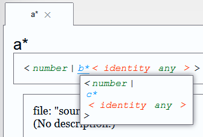

### Outline Primitives

There are 15 primitive types in LimnJS:
- any
- array
- bigint
- boolean
- function
- infinity
- NaN
- never
- null
- number
- object
- string
- symbol
- undefined
- unset

There are some oddities in this list.  

In vanilla JavaScript: "null" is an "object", "NaN" is a "number", and "array" is an "object".  
In LimnJS, all three are unique primitives.  
If a parameter requires a number, it will throw an error on receiving NaN.  
If a parameter requires an object, it will throw an error on receiving an array.

Examples of how to create each of these primitive types in Javascript:  
(There are many ways to make these. 
For example, arrays can be made with: `new Array()` or `[1,2,3]` or `Array.from( ... )` or `"123".split("")`, etc.)
- any: `var a;` (anything works)
- array: `var a = [1,2,3];`
- bigint: `var b = BigInt( 22 );`
- boolean: `var b = true;`
- function: `var f = function(){}`
- infinity: `var i = Infinity;`
- NaN: `var N = NaN;`
- never: Impossible. Nothing satisfies `"never"`
- null: `var n = null;`
- number: `var n = 1;`
- object: `var o = {};`
- string: `var s = "";`
- symbol: `var s = Symbol();`
- undefined: `var u = undefined;`
- unset: Varies. See the [unset](#unset) documentation below.

Why are LimnJS's primitives so different from JavaScript and TypeScript?  

1. Because outlines are so permissive, LimnJS needs stricter primitives.
2. These distinct primitives eliminate hard-to-track-down errors.  
    Code, that expects numbers especially statistics, should be able to
    throw an error on receiving NaN or Infinity. In vanilla JavaScript,
    no such error is possible.

In addition to these primitives, you may use the following array-like JavaScript objects as types.  
However! These will also fit type:"object", so be aware.
- BigInt64Array,
- BigUint64Array,
- Float32Array,
- Float64Array
- Int8Array,
- Int16Array,
- Int32Array,
- Uint8Array,
- Uint8ClampedArray,
- Uint16Array,
- Uint32Array,

### Outline Unions

An outline union uses `"|"` to separate several outlines.  
```javascript
MyApp.Outline( "lots*", "string|boolean|object|function" );
```  
An outline union mfits any of the outlines in its list.  
`"lots*"` in the example above will fit a string, a boolean, an object, or a function.

### Outline Intersections

Object outlines can be intersected to fit the properties of both.  
```javascript
MyApp.Outline( "hasA*", { "a": "any" } );
MyApp.Outline( "hasB*", { "b": "any" } );
MyApp.Outline( "hasAB*", "hasA*&hasB*" );
```  
The `"hasAB*"` outline requires everything from `"hasA*"` and everything from `"hasB*"`.  
The object `{a:42,b:true}` would fit `"hasAB*"`.  

Note:

In TypeScript intersections have only properties common to both interfaces.  
In LimnJS, intersections have all properties of both outlines.

### Custom Primitive Outlines

Create your own primitives by using functions as outline definitions.  
```javascript
MyApp.Outline( 
    ".seven*",
    function( target ) { 
        if( target === 7 ) return true;
        else return false;
    }
);
```  
An object will be passed to your function.  
If your function returns something truthy (read about truthy values on [MDN](https://developer.mozilla.org/en-US/docs/Glossary/Truthy)), that object will fit your outline.  
In the example above, only the number `7` will fit the outline `".seven*"`.  

Using arrow functions (read about arrow functions on [MDN](https://developer.mozilla.org/en-US/docs/Web/JavaScript/Reference/Functions/Arrow_functions)), primitives can be defined faster.  
Here is the `".seven*"` primitive defined using an arrow function.
```javascript
MyApp.Outline( ".seven*", n => n === 7 );
```

Behind the scenes, LimnJS primitives work exactly like custom primitives (except for `"unset"`).  
Here are their definitions:  
(You couldn't define these yourself, because custom outlines must end in `"*"`.)
```javascript

Outline( "any", () => true );
Outline( "array", a => Array.isArray( a ) );
Outline( "bigint", b => typeof b === "bigint" );
Outline( "boolean", b => typeof b === "boolean" );
Outline( "function", f => typeof f === "function" );
Outline( "infinity", n => ( 
        typeof n === "number" &&
        n === Infinity
    ) );
Outline( "NaN", n => ( 
        typeof n === "number" &&
        isNaN( n ) 
    ) );
Outline( "never", () => false );
Outline( "null", n => n === null );
Outline( "number", n => ( 
        typeof n === "number" && 
        ! isNaN( n ) &&
        n !== Infinity
    ) );
Outline( "object", o => ( typeof o === "object" && 
                o !== null && ! Array.isArray( o ) ) );
Outline( "string", s => ( typeof s === "string" ) );
Outline( "symbol", s => ( typeof s === "symbol" ) );
Outline( "undefined", u => ( typeof u === "undefined" ) );
Outline( "unset", () => false ); //unset is handled differently

Outline( "BigInt64Array", n => n instanceof BigInt64Array );
Outline( "BigUint64Array", n => n instanceof BigUint64Array );
Outline( "Float32Array", n => n instanceof Float32Array );
Outline( "Float64Array", n => n instanceof Float64Array );
Outline( "Int8Array", n => n instanceof Int8Array );
Outline( "Int16Array", n => n instanceof Int16Array );
Outline( "Int32Array", n => n instanceof Int32Array );
Outline( "Uint8Array", n => n instanceof Uint8Array );
Outline( "Uint8ClampedArray", n => n instanceof Uint8ClampedArray );
Outline( "Uint16Array", n => n instanceof Uint16Array );
Outline( "Uint32Array", n => n instanceof Uint32Array );
```

Note:  

Try to avoid using custom primitives.  
In LimnJS's documentation, `".seven*"` will simply be described as "primitive", which is not helpful.

### Familiar Primitive Imitation

If you prefer, please use the following outline definitions to imitate a more familiar primitive scheme for your usecase. (If you like JavaScript or TypeScript primitives, this avoids memorizing LimnJS's weird primitives.)

```javascript
//JavaScript primitives
MyApp.Outline( ".bigint*", "bigint" );
MyApp.Outline( ".boolean*", "boolean" );
MyApp.Outline( ".function*", "function" );
MyApp.Outline( ".number*", "number|NaN|Infinity" );
MyApp.Outline( ".object*", "object|array|null" );
MyApp.Outline( ".string*", "string" );
MyApp.Outline( ".symbol*", "symbol" );
MyApp.Outline( ".undefined*", "undefined" );
```

```javascript
//TypeScript primitives
MyApp.Outline( ".any*", "any" );
MyApp.Outline( ".array*", "array|null|undefined" );
MyApp.Outline( ".boolean*", "boolean|null|undefined" );
MyApp.Outline( ".function*", "function" );
MyApp.Outline( ".never*", "never" );
MyApp.Outline( ".null*", "null" );
MyApp.Outline( ".number*", "number|NaN|null|undefined" );
MyApp.Outline( ".object*", "object|array" );
MyApp.Outline( ".string*", "string|null|undefined" );
MyApp.Outline( ".undefined*", "undefined" );
MyApp.Outline( ".void*", "null|undefined" );
```

# Unset

The unset primitive allows for optional but constrained requirements in parameters, return values, array entries, and object properties.

## Unset Parameter

`"unset"` in a module parameter allows that parameter and those following to remain unspecified.

For example, with 1 optional parameter:
```javascript
MyApp( "myModule", {
...
parameters: [ "a:string|unset" ]
...
}
```
Here, `"myModule"` could be called as `myModule("hi!")` or `myModule()`.

Among several parameters, `"unset"` creates break points after which parameters can remain unspecified.
For example:
```javascript
MyApp( "myModule", {
...
parameters: [ 
    "a:number",
    "b:string|unset",
    "c:string",
    "d:string",
    "e:boolean|unset"
]
...
}
```
Means:  
"1. If only a was passed, that's fine."  
"2. If b was passed, then we also need c and d."  
"3. If only a, b, c, and d were passed, that's fine."  

## Unset Return

Unset allows your function to not return, which happens when throwing errors.
```javascript
MyApp( "myModule", {
...
returns: "boolean|unset"
...
}
```
Here, `"myModule"` must return a boolean if it returns, but it is also permitted to not return at all.

Note: No-return warnings are not implemented yet! Right now, returning `undefined` and not returning are equivalent.

## Unset Object Property

Unset on an object property allows that property to remain unspecified.

For example:
```javascript
MyApp.Outline( "if-a-then-num*", { "a": "number|unset" } )
```
`"if-a-then-num*"` requires that, if `"a"` is specified at all, it must be a number.  
It also allows `"a"` to go unspecified.  
`{a:5}` will fit.  
And `{}` will fit.  

`{a:"hi!"}` will not fit.  
`{a:undefined}` will not fit.  
If `"a"` is specified at all, it must be a `number`.  

## Unset Array Entries

Unset creates break-points in array entries after which entries may go unspecified.  
It is equivalent to saying "The array can end here if it wants to, but if it continues, it must fit this pattern."

For example:
```javascript
MyApp.Outline( "one-or-five-entries*", [ "any", "any|unset", "any", "any", "any" ] );
```
The array above will fit an array with 1 entry, or 5+ entries, but nothing in between.  
`[7]` will fit. Index 0 is 7, and index 1 is `"unset"`. `"unset"` breaks the array matching, since we reach the array's end.  
`[7,7,7,7,7, ...]` will fit, because indices 0 through 4 fit the `"any"` type.    

`[7,7,7]` will not fit.  
Indices 0, 1, and 2 fit the `"any"` type, but index 3 is `"unset"`.  
`"one-or-five-entries*"` requires that index 3 be of type `"any"`.

For example, to require an array either be empty or start with 3 numbers:
```javascript
MyApp.Outline( "three-nums-if-anything*", [ "number|unset", "number", "number" ] );
```

## Unset Array Template Entries

Note: This behavior is inconsistent / unintuitive and may be changed! I do not recommend using it for now.

Unset is ignored in array templates.

For example:
```javascript
MyApp.Outline( "str-nums*", [ "boolean", "string|unset", "number", "..." ] );
```
Is identical to:
```javascript
MyApp.Outline( "str-nums*", [ "boolean", "string", "number", "..." ] );
```
This is because matching a pattern after a break renders the next pattern element ambiguous.

# Recursive Definitions

```javascript
Outline( "nestedNumberArray*", [ "number|nestedNumberArray*", "..." ] )

fits( [ 0, [ 1 ], [ 2, 3, [ 4 ] ] ], "nestedNumberArray*" ); //true
```

## The Identity Outline

Direct recursion is defined as the identity outline, and is equivalent to "any".
```javascript
M.Outline( "self*", "self*" ); 
//equivalent: M.Outline( "self*", "any" );

fits( 777, "self*" ); //true
fits( null, "self*" ); //true
fits( {}, "self*" ); //true
```

The identity outline gives rise to recursive object templates, e.g. for linked lists.
```javascript
M.Outline( "ob*", {
    "alike": "ob*"
} ); 

let a = { alike: null };

fits( a, "ob*" ); //false

a.alike = a;

fits( a, "ob*" ); //true
```

However, the identity outline creates obfuscated "any" union definitions:

```javascript
//A cursory glance implies a*, b*, and c* are numbers
M.Outline( "a*", "number|b*" );
M.Outline( "b*", "number|c*" );
M.Outline( "c*", "number|a*" );
//However, a* === b* === c* ==> a*
//therefore, a*, b*, and c* are all identity outlines

fits( false, "a*" ); //true
```

When using recursive unions, carefully examine LimnJS's code explorer for unexpected identity outlines.

